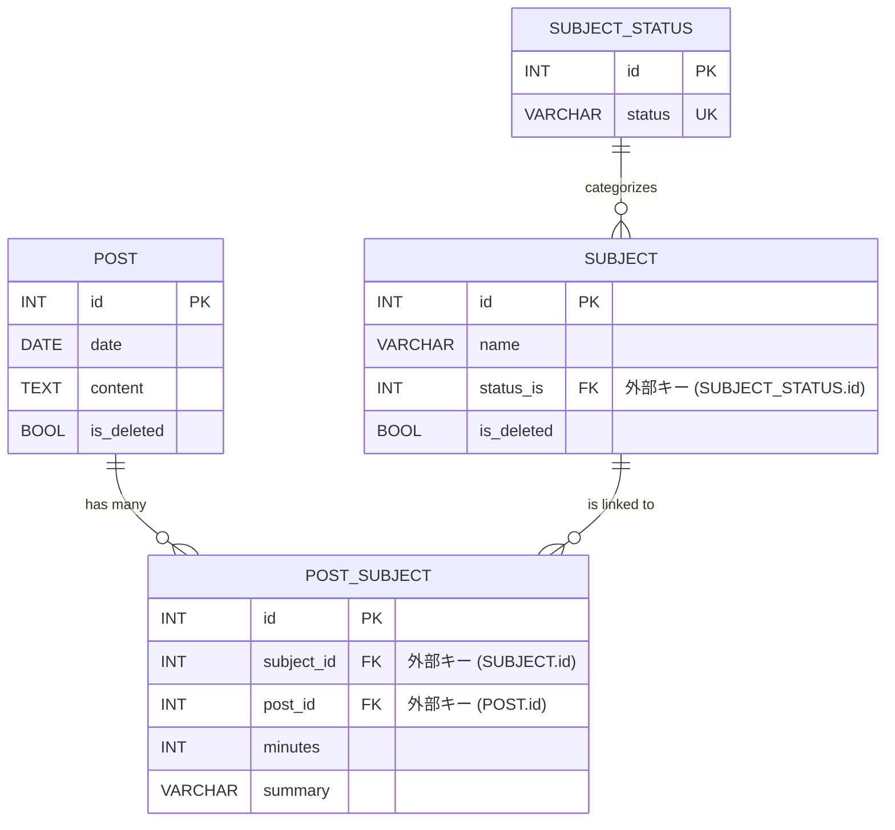
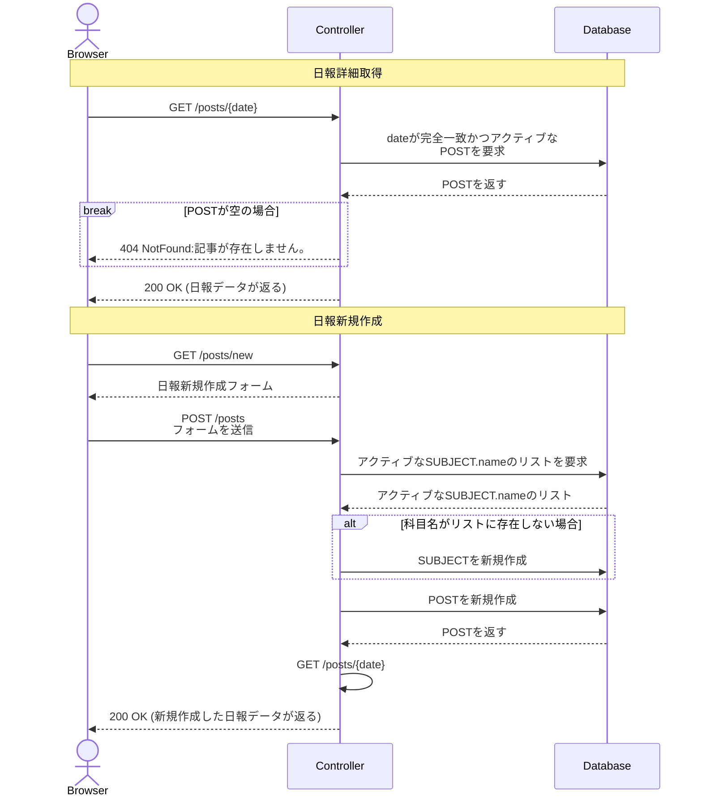
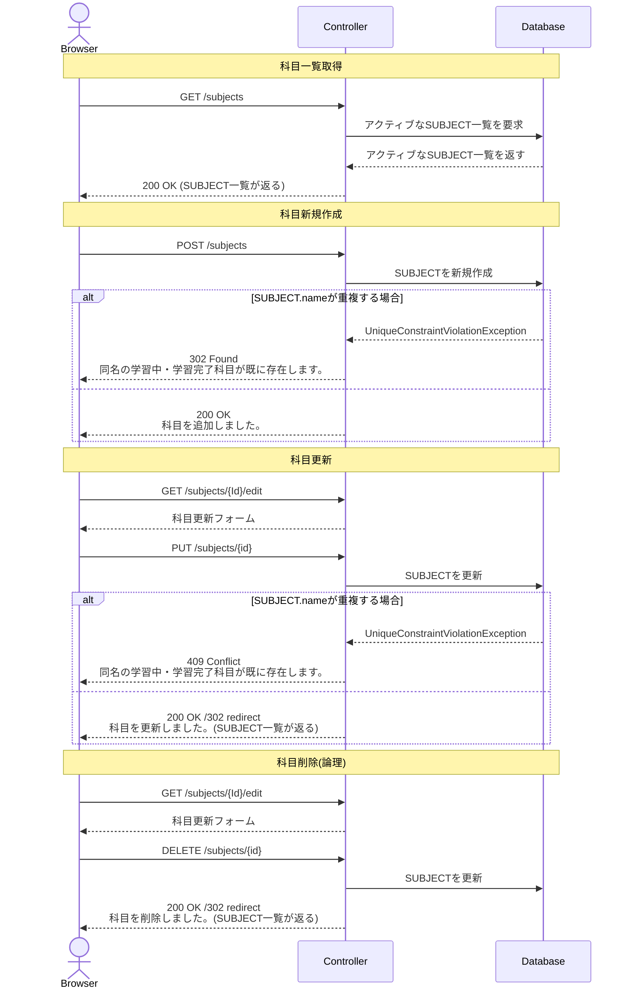

# 学習記録アプリ

## 概要 Summary

インプット→アウトプットを効果的・習慣的にするための日報あるいは学習記録webアプリケーション。

## 詳細 Detail
### 開発環境
#### 使用技術
- WSL(Ubuntu)
- PHP 8.2.29
- Symfony 7.3.4 
- Docker 28.5.1
- MySQL 8.0.44

#### 使用ツール
- Composer 2.8.12
- Cursor
- Xdebug
- Git
- GitHub
- phpMyAdmin

### ER図 Entity-Relation Diagram

### シーケンス図 Sequence Diagram
#### ▼日報管理機能

#### ▼科目管理機能

## 今後の課題
- 日報編集・削除機能の実装
- posts/{date}: {date}が形式不正、NotFoundの際の例外ハンドリング
- 認証機能実装およびCSRF対策有効化
